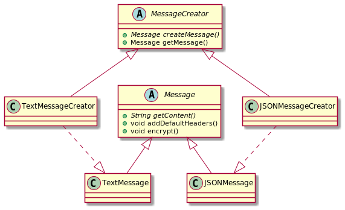

# Factory Method

### Implementation Considerations

* The creator can benefit a concrete class & provides a default implementation
  for the factory method. In such cases you'll create some
  "default" object in base creator.

* You can also use the Simple Factory way of accepting additional arguments 
  to choose between different object types. Subclasses can then override 
  factory method to selectively create different objects for some criteria.

### Design Considerations

* Creator hierarchy in factory method pattern reflects the product hierarchy.
  We typically end up with a concrete creator per object type.

* Template method design pattern often makes use of factory methods.

* Another creational design pattern called "abstract factory" makes use of 
  factory method pattern.

# Pitfalls

* More complex to implement. More classes involved and need unit testing.

* You have to start with Factory Method design pattern from the beginning. 
  It's not easy to refactor existing code into factory method pattern.

* Sometimes this pattern forces you to subclass just to create appropriate 
  instance.

# In-A-Hurry Summary

* Use factory method pattern when you want to delegate object instantiation 
  to subclasses, you'd want to do this when you have "product" inheritance 
  hierarchy and possibility of future additions to that.
