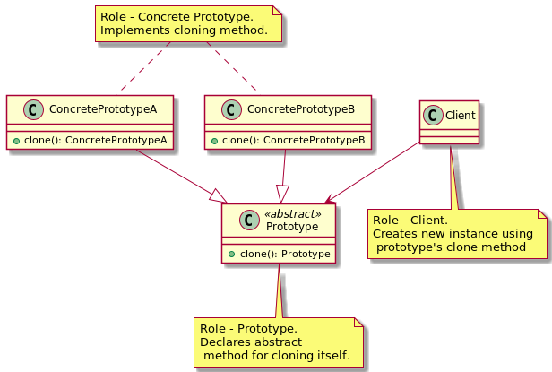
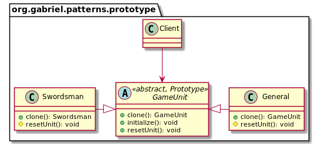

# Prototype

### Whats is a Prototype?

* We have a complex object that is costly to create. To create more instances of such class, we use an existing instance
  as our prototype.

* Prototype will allow us to make copes of existing object & save us from having to recreate objects from scratch.

### UML

### Implement a Prototype

* We start by creating a class which will be a prototype
    * The class must implement Cloneable interface
    * Class should clone method and return copy of itself
    * The method should declare CloneNotSupportedException in throws clause to give subclasses chance to decide on
      whether to support cloning.
* Clone method implementation should consider the deep & shallow copy and choose a whichever is applicable.

### Implementation Considerations

* Pay attention to the deep copy and shallow copy of references. Immutable fields on clones save the trouble of deep
  copy.
* Make sure to reset the mutable state of object before returning the prototype. It's a good idea to implement this in
  method to allow subclasses to initialize themselves.
* clone() method is protected in Object class and must be overridden to be public to be callable from outside the class.
* Cloneable is a "marker" interface an indication that the class supports cloning.

### Design Considerations

* Prototypes are useful when you have large objects where majority of state is unchanged between instances, and you can
  easily identify that state.
* A prototype registry is a class where in you can register various prototypes which other code can access to clone out
  instances. This solves the issue of getting access to initial instance.
* Prototypes are useful when working with Composite and Decorator pattern.

### Comparison with Singleton

|Prototype                                                                          |Singleton                          |
|:---------------------------------------------------------------------------------:|:---------------------------------:|
|We return a copy of an instance, meaning we get a different instance.              |We return same instance every time.|
|Some or even all of the state of instances created with prototypes can be different|Since it's the same object that is returned state is always the same|

### Pitfalls

* Usability depends upon the number of properties in state that are immutable or can be shallow copied. An object 
  where state is comprised of large number of mutable objects is complicated to clone.
* In Java the default clone operation will only perform the shallow copy so if you need a deep copy you've to 
  implement it.
* Subclasses may not be able to support clone and so the code becomes complicated as you have to code for situations 
  where an implementation may not support clone.
### In-A-Hurry Summary
* Think of prototype pattern when you have an object where construction of a new instance is costly or not possible 
  (object is supplied to your code).
* In Java, we typically implement this pattern with clone method.
* Objects which have a majority of their state as immutable are good candidates for prototypes.
* When implementing clone method pay attention to the requirement of deep or shallow copy of object state.
* Also, we've to ensure that clone is "initialized"; that is appropriate states are reset before returning the copy to 
  outside world.